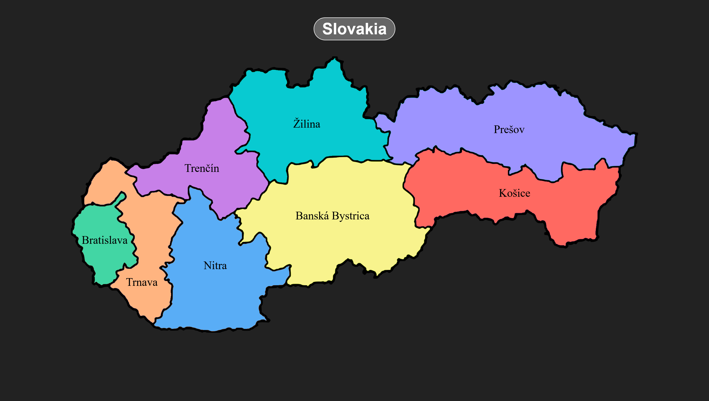
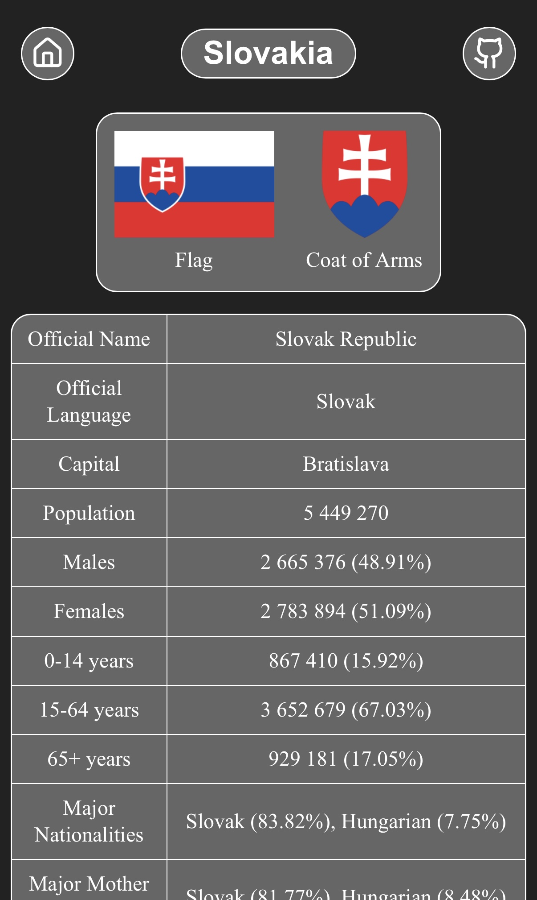
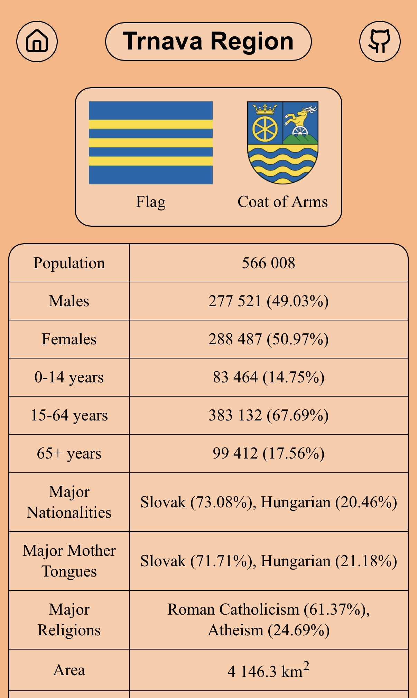

# 🗺️ Slovakia

A minimalist website providing information about Slovakia and its regions, created using pure HTML and CSS. You can check it out [here](https://arsenicum333.github.io/Slovakia/).

## 📸 Preview

  
  

## 📖 About the Project

This project was created to practice HTML and CSS while gathering key statistical data about Slovakia and its regions. The website is fully responsive and looks great on all screens, from smartphones to desktop monitors.

## 🔎 Usage

The homepage features links to all regions of Slovakia. Click on any region to view its specific information, or click the **Slovakia** button for general data about the country.

## 💡 What I Learned & Customized

- **Fluid Responsiveness** - Built scalable layouts using modern CSS functions like `clamp()`, Flexbox, and relative units.
- **Custom Scrollbars** - Styled scrollbars for both WebKit browsers and Firefox (`scrollbar-color`, `::-webkit-scrollbar`).
- **Interactive UI Elements** - Styled links, SVG icon buttons with hover transitions, and custom table borders.
- **Theme Accents** - Customized text selection colors (`::selection`) tailored to each region's individual theme color.
- **Semantic Structure** - Structured pages using standard HTML5 semantic elements (`<header>`, `<main>`, `<figure>`, `<table>`, `<footer>`, etc.).