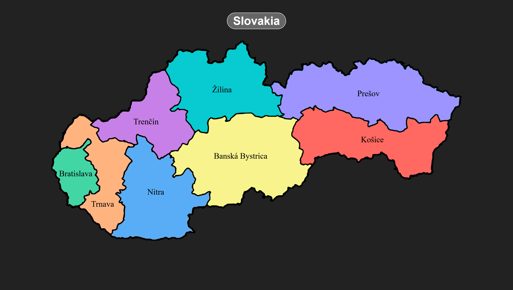
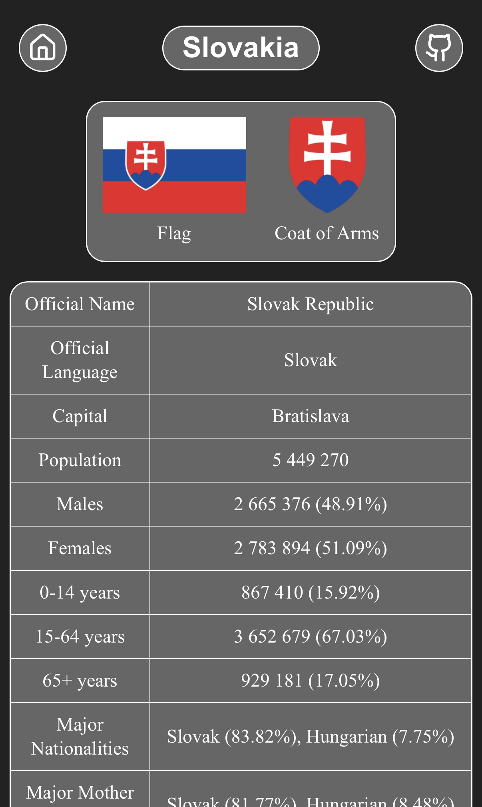
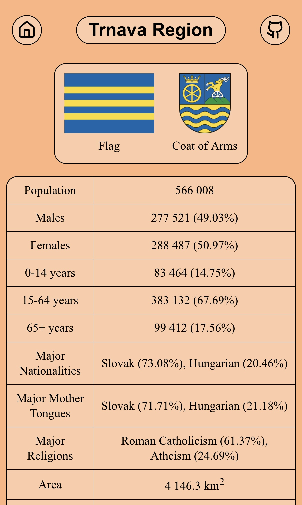

# 🗺️ Slovakia

A minimalist website about Slovakia and its regions, created to practice HTML and CSS. You can check it out [here](https://arsenicum333.github.io/Slovakia/).

## 📸 Screenshots

<table>
  <tr>
    <td align="left">
      
    </td>
    <td align="right">
      
    </td>
  </tr>
</table>

## 📖 About the Project

This project was created as a way to practice HTML and CSS by building an informational website about Slovakia and its regions. Along the way, I also gathered statistical data about the country and its regions to use as the website's content.

The website is fully responsive and works across different screen sizes, from smartphones to desktop monitors.

## 🧭 Navigation

When you first open the website, the homepage provides links to all regions of Slovakia. Click on any region to view its information, or click the **Slovakia** button for general information about the country.

## 💡 What I Learned

- **Fluid Responsiveness** - Built scalable layouts using modern CSS functions such as `clamp()`, `min()`, and `max()`, along with Flexbox and relative units.
- **Custom Scrollbars** - Styled scrollbars for both WebKit browsers and Firefox using `scrollbar-color` and `::-webkit-scrollbar`.
- **Interactive UI Elements** - Styled links, SVG icon buttons with hover transitions, and custom table borders.
- **Theme Accents** - Customized text selection colors using `::selection`, with each region having its own theme color.
- **Semantic Structure** - Structured pages using standard HTML5 semantic elements such as `<header>`, `<main>`, `<figure>`, `<table>`, and `<footer>`.
